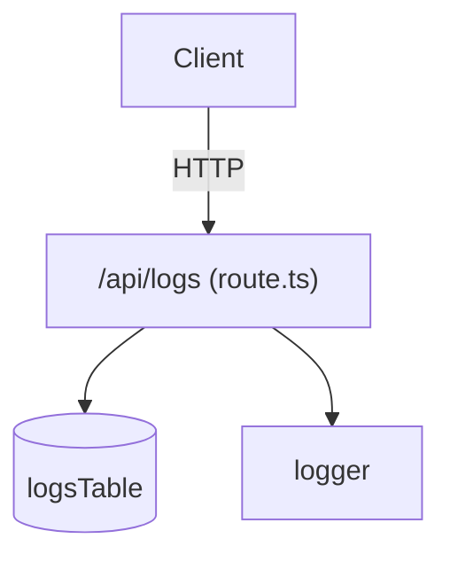

# `/api/logs`

Provides a **REST interface** to read, write, and delete log records stored in
the PostgreSQL `logs` table. It complements the automatic logging performed by
the `PostgresTransport` and is useful for dashboards, operations scripts, or
cleanup cron jobs.

_File location_: `src/app/api/logs/route.ts`

---

## Endpoints & Behaviour

| Method   | Description                                                         |
| -------- | ------------------------------------------------------------------- |
| `GET`    | Retrieve log entries with optional filters, ordered by most recent. |
| `POST`   | Insert a _new_ log entry of a specified level for testing/demo.     |
| `DELETE` | Remove logs older than N days (data retention).                     |

All methods return **JSON**.

---

## 1. `GET /api/logs`

### Query Parameters

| Param    | Type                                        | Required | Description                         |
| -------- | ------------------------------------------- | -------- | ----------------------------------- |
| `level`  | `string` (`debug`\|`info`\|`warn`\|`error`) | No       | Filter by log level.                |
| `limit`  | `number` (default **50**)                   | No       | Max rows to return.                 |
| `offset` | `number` (default **0**)                    | No       | Pagination offset.                  |
| `userId` | `string` (UUID)                             | No       | Filter by user.                     |
| `since`  | `string` (ISO date)                         | No       | Return logs _after_ this timestamp. |

### Success Response

```jsonc
{
  "logs": [
    /* SelectLog[] */
  ],
  "pagination": {
    "limit": 50,
    "offset": 0,
    "count": 50
  }
}
```

Status code: **200**.

### Failure Response

`{ "error": "Failed to retrieve logs" }` with **500** code.

---

## 2. `POST /api/logs`

Allows developers to create a **manual** log entry for testing transport
pipelines or UI viewers.

### Body JSON

| Field     | Type                                     | Required | Notes                     |
| --------- | ---------------------------------------- | -------- | ------------------------- |
| `level`   | `"debug" \| "info" \| "warn" \| "error"` | **Yes**  | Log severity.             |
| `message` | `string`                                 | **Yes**  | Log text.                 |
| `meta`    | `object`                                 | No       | Additional JSON metadata. |
| `userId`  | `string` (UUID)                          | No       | Associated user.          |

### Responses

_Success_: `{ "success": true, "message": "Log entry created", "requestId": "…" }`

_Error_: `{ "error": "Level and message are required" }` (400) or generic 500.

---

## 3. `DELETE /api/logs`

Deletes log entries older than **N** days (default 30).

### Query Parameters

| Param  | Type     | Required | Description                        |
| ------ | -------- | -------- | ---------------------------------- |
| `days` | `number` | No       | Retention window (defaults to 30). |

### Responses

_Success_ (`200`):

```jsonc
{
  "success": true,
  "message": "Cleaned up logs older than 30 days",
  "cutoffDate": "2025-05-19T18:54:22.123Z"
}
```

_Failure_ (`500`): `{ "error": "Failed to clean up log entry" }`

---

## Internal Implementation Details

| Utility                    | Role                                                      |
| -------------------------- | --------------------------------------------------------- |
| `extractRequestContext()`  | Extracts IP, UA, etc., to attach request-scoped metadata. |
| `createRequestLogger()`    | Returns bound logger for consistent context fields.       |
| `db` & `logsTable`         | Drizzle ORM objects for SQL operations.                   |
| `and`, `eq`, `gte`, `desc` | Drizzle query builder helpers used to build filters.      |

Error handling is centralised through `logError()` (writes to Winston + DB).

---

## Relationships & Consumers

| File / Module                          | Interaction                                                          |
| -------------------------------------- | -------------------------------------------------------------------- |
| `src/lib/logger/postgres-transport.ts` | Writes bulk logs **into the same table** but _not_ through this API. |
| Front-end tools (future)               | Could call `GET` to display logs or `DELETE` to purge old ones.      |

### Diagram



---

## Extending

1. **Add more filters** – modify the conditions array in `GET` handler.
2. **Pagination metadata** – include `totalCount` (e.g., via `count(*)`).
3. **Authentication** – Protect route with middleware & verify JWT/session.
4. **CSV/NDJSON export** – Add `GET ?format=csv` option that streams data.

---

Made with 🗃️ + Drizzle ORM.
