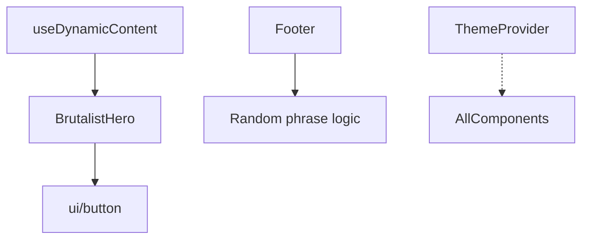

# React Components

This folder contains **presentational** and **UI-utility** components used by the
Next.js application. Below is an overview of their public API and their
relationships to hooks or other modules.

| Component         | File                   | Props                                                                               | Consumes / Depends On                                              |
| ----------------- | ---------------------- | ----------------------------------------------------------------------------------- | ------------------------------------------------------------------ |
| `BrutalistHero`   | `brutalist-hero.tsx`   | – _(internal state only)_                                                           | `useDynamicContent()` hook (see `src/hooks`), Tailwind CSS classes |
| `BrutalistFooter` | `brutalist-footer.tsx` | –                                                                                   | Internal `useState`/`useEffect` animation logic                    |
| `ThemeProvider`   | `theme-provider.tsx`   | `ThemeProviderProps` from `next-themes`                                             | Wraps `next-themes` `<ThemeProvider>`                              |
| **UI primitives** | `ui/` sub-directory    | Variant-based props via [class-variance-authority](https://github.com/joe-bell/cva) | Utility `cn()` helper & Tailwind classes                           |

---

## 1. `BrutalistHero`

A full-page hero section that dynamically pulls text content from the AI layer.

### Internal State

- `glitchText : string` – Temporary string used to render random characters while loading.
- `chaosMode : boolean` – Toggles special CSS animations and extra screen elements.
- `chaosElements : Array<{ id; x; y; color; size; rotation }>` – Random shapes rendered in chaos mode.

### External Interactions

| Function              | Purpose                                                                      |
| --------------------- | ---------------------------------------------------------------------------- |
| `useDynamicContent()` | Supplies `content`, `isLoading`, and `regenerate()` used by buttons & text.  |
| `regenerate()`        | Bound to "REGENERATE" button – forces a new call to `/api/generate-content`. |

### Used By

- `src/app/page.tsx` (landing page) – imported directly to render the hero.

---

## 2. `BrutalistFooter`

Animated footer that periodically shows rotating slogans. Does **not** receive
props and has no external dependencies beyond React state/hooks.

### Behaviour

- Cycles through an array of phrases every **3 seconds**.
- Shows a glitch animation for 200 ms before switching text.
- Includes decorative grid & shape elements styled with Tailwind.

### Used By

- `src/app/page.tsx` – renders at the bottom of the landing page.

---

## 3. `ThemeProvider`

Wrapper around `next-themes` provider so that other components can use dark /
light modes.

```tsx
// Example
import { ThemeProvider } from "@/components/theme-provider";

export default function RootLayout({
  children,
}: {
  children: React.ReactNode;
}) {
  return (
    <html lang="en">
      <body>
        <ThemeProvider attribute="class" defaultTheme="system" enableSystem>
          {children}
        </ThemeProvider>
      </body>
    </html>
  );
}
```

### Props (passthrough)

All props accepted by `next-themes` `ThemeProvider` are forwarded. See
[documentation](https://github.com/pacocoursey/next-themes#props) for full list.

---

## 4. UI Primitives (`components/ui/*`)

The `ui` subfolder holds small, reusable components built with
[Radix UI](https://www.radix-ui.com/) and `class-variance-authority`.
They **export** helpers such as:

- `Avatar` / `Badge` / `Button` / `Card` / `Separator` / `Skeleton`

### Example: `Button`

```tsx
import { Button } from "@/components/ui/button";

<Button variant="destructive" size="lg">
  Delete
</Button>;
```

`ButtonProps` combines intrinsic `button` attributes with:

| prop      | Type                                                                          | Default     | Variants                                        |
| --------- | ----------------------------------------------------------------------------- | ----------- | ----------------------------------------------- |
| `variant` | `"default" \| "destructive" \| "outline" \| "secondary" \| "ghost" \| "link"` | `"default"` | Tailwind style sets                             |
| `size`    | `"sm" \| "default" \| "lg" \| "icon"`                                         | `"default"` | Height & padding presets                        |
| `asChild` | `boolean`                                                                     | `false`     | Render via Radix `<Slot>` instead of `<button>` |

Other primitives follow a similar pattern.

---

## Dependency Diagram



---

## Extending Components

1. **Add new UI primitive** – Create file in `ui/`, export component & variants.
2. **Reuse hook** – Import `useDynamicContent()` in any other component needing the same content.
3. **Additional themes** – Pass extra props to `ThemeProvider` or subclass Tailwind themes.

---

Made with 🎨 + ⚛️.
