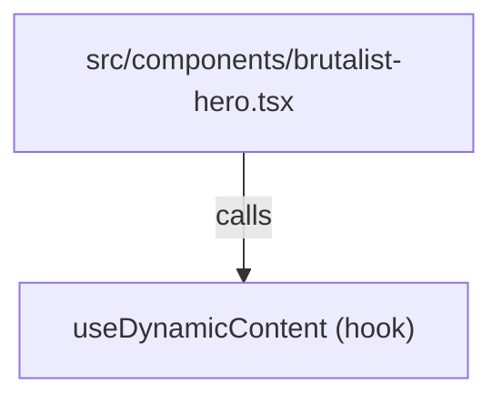

# React Hooks

This directory currently exposes a **single custom hook** that powers the AI-driven content refresh logic on the landing page.

| Hook                  | File                     | Purpose                                                                                                                                             |
| --------------------- | ------------------------ | --------------------------------------------------------------------------------------------------------------------------------------------------- |
| `useDynamicContent()` | `use-dynamic-content.ts` | Retrieves AI-generated text from `/api/generate-content`, caches it in `localStorage`, and provides helpers to re-generate or trigger "chaos mode". |

---

## `useDynamicContent()`

```ts
const {
  content, // GeneratedContent | null
  isLoading, // boolean
  error, // string | null
  regenerate, // () => Promise<void>
  chaosMode, // () => Promise<void>
  metadata, // Generation metadata (timestamps, model, etc.) | null
} = useDynamicContent();
```

### Return Shape (`UseDynamicContentReturn`)

| Field          | Type                                                                                                                                 | Description                                                                                                        |
| -------------- | ------------------------------------------------------------------------------------------------------------------------------------ | ------------------------------------------------------------------------------------------------------------------ |
| `content`      | `GeneratedContent \| null`                                                                                                           | The latest generated payload (see `src/lib/ai/content-generator.ts`).                                              |
| `isLoading`    | `boolean`                                                                                                                            | `true` while a network request or cache lookup is in flight.                                                       |
| `error`        | `string \| null`                                                                                                                     | Error message when the fetch fails (auto-cleared if cache is used as fallback).                                    |
| `regenerate()` | `() → Promise<void>`                                                                                                                 | Forces a new generation (POST `/api/generate-content` with `{ forceRegenerate: true }`). Clears local cache first. |
| `chaosMode()`  | `() → Promise<void>`                                                                                                                 | Same as `regenerate` but passes `theme: "chaos"` to create glitchy content.                                        |
| `metadata`     | `{ generatedAt: string; generationTime: number; model: string; version: string; aiGenerated: boolean; confidence: number; } \| null` | Diagnostic info returned by the API.                                                                               |

### Internal Workflow

1. **Cache-first** – On mount, the hook tries to read `localStorage["portfolio-content-mobilebert"]`. If the cached entry is < 30 minutes old it is returned immediately.
2. **Network Fetch** – When no valid cache exists (or after `regenerate/chaosMode`) it issues a `fetch` to `/api/generate-content`.
3. **Status & Error Handling** – `isLoading` and `error` states are managed around the async call. On failure the hook attempts to fall back to cached data.
4. **Re-validation** – Successful responses are written back to cache together with a timestamp.

### Parameters

`useDynamicContent` does **not** take arguments. Behaviour is controlled through the two helper functions it returns.

---

## Consumers



The **`BrutalistHero`** component is currently the sole consumer of this hook. It uses:

- `content` to populate the title, subtitle, and description.
- `isLoading` to display glitch animations.
- `regenerate()` bound to a UI button (not shown here) for on-demand refreshes.
- `chaosMode()` to activate the special visual mode.

> Any other component may import the hook to gain instant access to the same content & helpers.

---

## Extending the Hook

1. **Different cache key / duration** – Adjust `localStorage` key or `maxAge` inside `loadFromCache()`.
2. **Support for SSR** – Convert storage access guards (`typeof window !== "undefined"`) to proper `useEffect` fallbacks or use cookies.
3. **Additional API parameters** – Modify the `body` payload in `fetchContent()` and expose a new helper similar to `chaosMode()`.

---

Made with ⚛️ + TypeScript.
