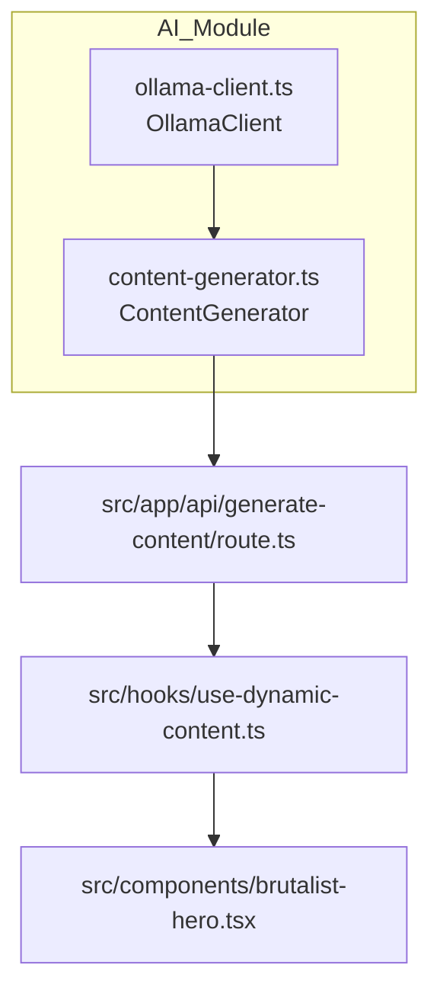

# AI Content Generation Module

This directory contains the **dynamic content generation** layer of the project.  
It consists of two cooperating classes that wrap a local [Ollama](https://ollama.ai/) LLM and expose a higher-level API that the rest of the application can consume.

## File Overview

| File                                            | Purpose                                                                                                                                  |
| ----------------------------------------------- | ---------------------------------------------------------------------------------------------------------------------------------------- |
| `ollama-client.ts`                              | Low-level HTTP wrapper around the local Ollama REST API.                                                                                 |
| Translates prompts into a synchronous response. |
| `content-generator.ts`                          | High-level orchestrator that calls `ollamaClient` (or falls back to purely random generators) to build a full `GeneratedContent` object. |

---

## 1. `OllamaClient`

```txt
src/lib/ai/ollama-client.ts
```

### Constructor

| Parameter | Type     | Default                                                  | Description                                         |
| --------- | -------- | -------------------------------------------------------- | --------------------------------------------------- |
| `baseUrl` | `string` | `process.env.OLLAMA_API_URL \| "http://localhost:11434"` | Root URL of the Ollama HTTP server.                 |
| `model`   | `string` | `process.env.OLLAMA_MODEL \| "llama3.2"`                 | Model name passed to Ollama's `/api/chat` endpoint. |

> Environment variables let you switch models or remote hosts without recompiling.

### Public Methods

| Method                  | Return type                                                             | Parameters | Description                                                                                                     |
| ----------------------- | ----------------------------------------------------------------------- | ---------- | --------------------------------------------------------------------------------------------------------------- |
| `generateTitle()`       | `Promise<string>`                                                       | –          | Generates a **two-word** uppercase title. When the request fails it falls back to a deterministic random title. |
| `generateSubtitle()`    | `Promise<string>`                                                       | –          | Generates a 3-5-word subtitle. Falls back to random phrase on failure.                                          |
| `generateDescription()` | `Promise<string>`                                                       | –          | Generates a one-sentence description. Falls back to `generateFallbackDescription()`.                            |
| `isAvailable()`         | `Promise<boolean>`                                                      | –          | Ping-style check that issues a `GET /api/tags` to verify Ollama is reachable.                                   |
| `getModelInfo()`        | `{ model: string; provider: "Ollama"; baseUrl: string; type: string; }` | –          | Diagnostic helper containing the currently configured model information.                                        |

#### Internal Helpers (private)

- `getPromptResponse(prompt: string)` – Shared HTTP POST logic used by the three _generate…_ methods.
- `generateFallbackDescription()` – Local random sentence pool.

---

## 2. `ContentGenerator`

```txt
src/lib/ai/content-generator.ts
```

### Public API

| Method                                  | Return type                 | Parameters                                                                                    | Description                                         |
| --------------------------------------- | --------------------------- | --------------------------------------------------------------------------------------------- | --------------------------------------------------- |
| `generateContent(forcedTheme?: string)` | `Promise<GeneratedContent>` | `forcedTheme?` – Optional theme override (`"brutal"`, `"chaos"`, `"random"`, `"aggressive"`). | Builds a fully populated `GeneratedContent` object. |

It calls Ollama **per field** (title, subtitle, description) and silently falls back to random content when any call fails.  
If `forcedTheme === "chaos"` it skips the LLM and produces deterministic "chaos" strings instead. |

`GeneratedContent` interface defines the structure returned to the UI. Key fields:

```ts
{
  heroTitle: string;
  heroSubtitle: string;
  heroDescription: string;
  aboutDescription: string;
  skillsFocus: string[];
  projectIdeas: string[];
  personalityTrait: string;
  currentMood: string;
  workingOn: string;
  availability: "available" | "busy" | "selective";
  theme: "brutal" | "chaos" | "random" | "aggressive";
  confidence: number;    // 0-1 based confidence score
  aiGenerated: boolean;  // true if at least one Ollama call succeeded
}
```

### Internal Helper Groups

The class contains a rich set of **private** helper methods split in three groups:

1. **Random-pool generators** – e.g. `generateRandomTitle`, `generateRandomSubtitle`, `generateRandomDescription`, `generateSkills`, …
2. **Chaos generators** – e.g. `generateChaosTitle`, `generateChaosSubtitle`, `generateChaosDescription`.
3. **Utility helpers** – `getRandomizedFallback()`, `generateFallbackAbout()`.

These helpers are _implementation details_ and are not intended for consumption outside the class.

### Singleton Export

```ts
export const contentGenerator = new ContentGenerator();
```

Importing modules should **always** reuse this singleton – it keeps the API stateless while avoiding needless instantiation overhead.

---

## Dependency / Usage Map



### Narrative List

1. `BrutalistHero` component calls **`useDynamicContent()`**.
2. The hook issues requests to **`/api/generate-content`**.
3. The API route invokes the shared singleton **`contentGenerator`**.
4. `ContentGenerator` internally delegates LLM-powered text generation to **`ollamaClient`**.

> Any new component can benefit from generated content by either re-using the hook or by directly calling the `/api/generate-content` endpoint.

---

## Extending / Modifying

- **Switch model** – set `OLLAMA_MODEL` in your `.env` file.
- **Point to remote Ollama** – set `OLLAMA_API_URL`.
- **Add new generated fields** –
  1. Extend `GeneratedContent` interface.
  2. Add corresponding helper(s) in `ContentGenerator`.
  3. Populate the field inside `generateContent()`.
- **Consume from UI** – simply read from the JSON returned by the hook/API.

---

Made with ❤️ & TypeScript.
