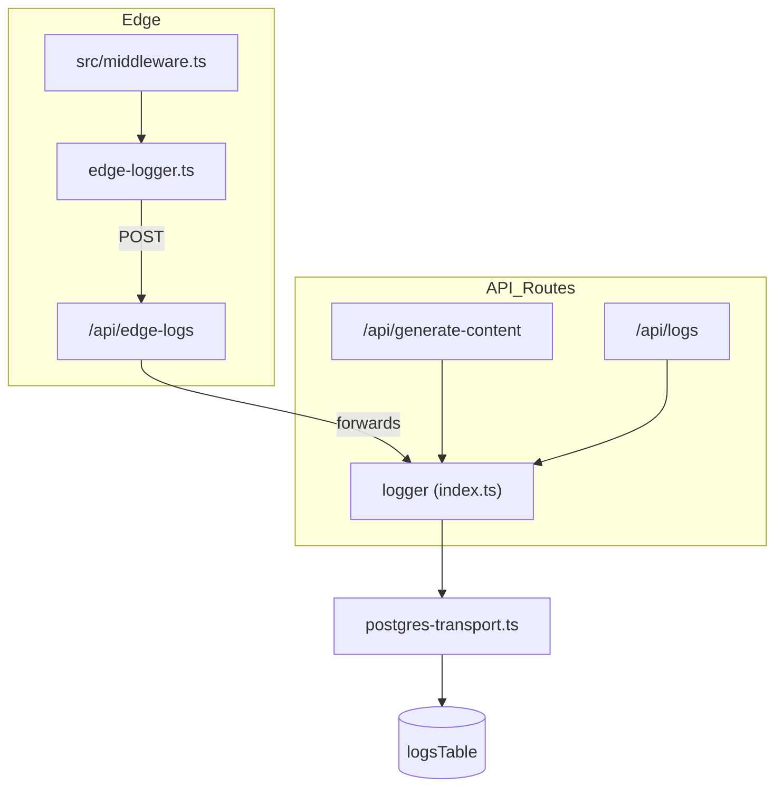

# Logging Layer

This folder implements a **multi-transport logging system** that works both in
Node.js (API routes, server components) and in the **Edge Runtime** (Next.js
middleware).

| File                    | Responsibility                                                                                                   |
| ----------------------- | ---------------------------------------------------------------------------------------------------------------- |
| `index.ts`              | Global Winston logger with console / file / PostgreSQL transports and helper utilities.                          |
| `edge-logger.ts`        | Lightweight logger that is safe to run inside the Edge Runtime. Sends data back to the main logger through HTTP. |
| `postgres-transport.ts` | Custom Winston transport that batches writes to the `logs` table declared in `src/lib/db/schema.ts`.             |
| `types.ts`              | Shared metadata interfaces used across the logging helpers.                                                      |

---

## 1. `index.ts`

### Public Exports

| Symbol                                                     | Type                                                    | Description                                                                                                                     |
| ---------------------------------------------------------- | ------------------------------------------------------- | ------------------------------------------------------------------------------------------------------------------------------- |
| `logger`                                                   | `winston.Logger`                                        | Fully configured Winston instance. Console output is **colored** in development, errors-only in production.                     |
| `extractRequestContext(request)`                           | `(NextRequest) → RequestContext`                        | Generates a unique `requestId` and collects IP, UA, method, URL, startTime.                                                     |
| `createRequestLogger(context)`                             | `(RequestContext) → { error, warn, info, debug, http }` | Returns _bound_ helpers that automatically merge the provided context into every log line.                                      |
| `logHttpRequest(context, statusCode, responseTime, meta?)` | `void`                                                  | Convenience wrapper to log a request once a response is produced. Chooses `info` / `warn` / `error` level based on status code. |
| `logError(error, context?, meta?)`                         | `void`                                                  | Logs an exception with stack trace and optional context.                                                                        |
| `logAuth(event, userId?, context?, meta?)`                 | `void`                                                  | Semantic helper for authentication events (`login`, `signup`, …).                                                               |
| `logDatabase(operation, table, context?, meta?)`           | `void`                                                  | Emits a `debug` line for DB operations.                                                                                         |

The module also installs **global listeners** for:

- `unhandledRejection`
- `uncaughtException`
- `process.warning`

so catastrophic errors are still captured even if forgotten elsewhere.

### Environment Variables

| Variable             | Default       | Effect                                                                                                                  |
| -------------------- | ------------- | ----------------------------------------------------------------------------------------------------------------------- |
| `NODE_ENV`           | `development` | Decides console log level & color usage.                                                                                |
| `LOG_LEVEL`          | `info`        | Minimum level accepted by `logger`.                                                                                     |
| `LOG_TO_FILE`        | –             | When `"true"`, enables [`winston-daily-rotate-file`](https://github.com/winstonjs/winston-daily-rotate-file) transport. |
| `LOG_RETENTION_DAYS` | `30d`         | How long rotated log files are kept.                                                                                    |
| `LOG_TO_DATABASE`    | –             | When `"true"`, attaches the custom PostgreSQL transport.                                                                |

---

## 2. `edge-logger.ts`

Edge Runtime cannot use Node.js APIs such as `fs` or native modules, so this
file re-implements a **minimal logger** that only relies on `console` and
`fetch`.

### Key APIs

| Symbol                                                         | Type                                 | Description                                                          |
| -------------------------------------------------------------- | ------------------------------------ | -------------------------------------------------------------------- |
| `LogLevel`                                                     | `enum { DEBUG, INFO, WARN, ERROR }`  | Numeric mapping compatible with console methods.                     |
| `edgeLogger`                                                   | `EdgeLogger`                         | Singleton instance with `.debug`, `.info`, `.warn`, `.error`.        |
| `extractEdgeRequestContext(request)`                           | `(NextRequest) → EdgeRequestContext` | Creates a lightweight context without using `uuid` (smaller bundle). |
| `logEdgeHttpRequest(context, statusCode, responseTime, meta?)` | `void`                               | Client-side equivalent of `logHttpRequest`.                          |
| `logEdgeError(error, context?, meta?)`                         | `void`                               | Sends an error to the edge logger.                                   |

When `process.env.EDGE_LOG_ENDPOINT` is defined, every log entry is **POSTed**
to that endpoint (typically `/api/edge-logs`).

### Used By

- `src/middleware.ts` – global request logging (see `extractEdgeRequestContext`, `logEdgeHttpRequest`, `logEdgeError`).

---

## 3. `postgres-transport.ts`

Custom Winston transport that batches log lines and writes them into the
`logs` table declared in the database schema.

### Constructor Options

| Option                | Type      | Default     | Purpose                                             |
| --------------------- | --------- | ----------- | --------------------------------------------------- |
| `batchSize`           | `number`  | `10`        | Number of log records written per insert.           |
| `flushInterval`       | `number`  | `5000` (ms) | Timer that triggers a batch flush even if not full. |
| `includeUserTracking` | `boolean` | `true`      | Whether to keep `userId`, `sessionId`, etc.         |

### Public Methods

| Method                 | Return | Description                                                                               |
| ---------------------- | ------ | ----------------------------------------------------------------------------------------- |
| `.log(info, callback)` | `void` | Winston calls this for each log line; the method transforms input & adds it to the batch. |
| `.close()`             | `void` | Cancels flush timer and writes remaining logs.                                            |

> The factory `createPostgresTransport(opts?)` returns a ready-to-use instance
> and is consumed inside `index.ts`.

### Safety Features

- **Validation** – Ensures mandatory fields exist, UUIDs are well-formed, and column length limits are respected.
- **Batch Retry** – On batch failure it retries each record individually to pinpoint malformed entries.

---

## 4. `types.ts`

Centralised place for **metadata** TypeScript interfaces so that log helpers can
remain strongly typed without circular imports.

Important unions:

```ts
export type LogMetadata =
  | BaseLogMetadata
  | HttpLogMetadata
  | ErrorLogMetadata
  | AuthLogMetadata
  | DatabaseLogMetadata
  | Record<string, unknown>;
```

---

## Dependency / Usage Diagram



---

## Extending the Logger

1. **Add a new transport** – import it in `createLogger()` inside `index.ts` and
   push it to the `transports` array.
2. **Log from Edge Worker** – call `edgeLogger.info()` (or other level). Ensure
   `EDGE_LOG_ENDPOINT` is set.
3. **Store extra metadata** – extend `BaseLogMetadata` or one of the more
   specific interfaces in `types.ts`.

---

Made with 📝 + Winston.
