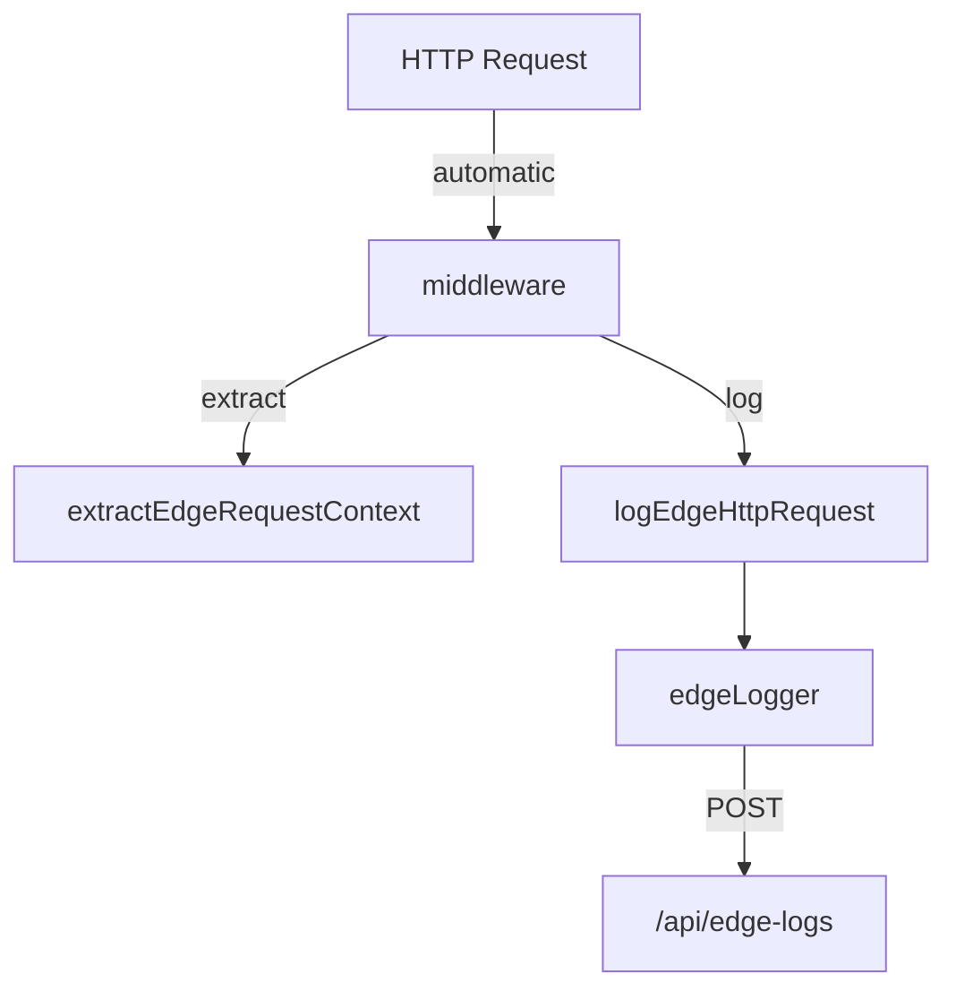

# `src/middleware.ts`

Next.js **Middleware** that runs on every (non-static) request, measuring timing
and forwarding structured logs to the **Edge Logger**.

---

## Exports

| Symbol       | Type                                             | Description                                                                                                                          |
| ------------ | ------------------------------------------------ | ------------------------------------------------------------------------------------------------------------------------------------ |
| `middleware` | `(request: NextRequest) → Promise<NextResponse>` | Main handler executed by the Next.js runtime. Performs logging and returns the (unchanged) response or an error response on failure. |
| `config`     | `MiddlewareConfig`                               | Next.js matcher object that specifies which paths trigger the middleware.                                                            |

Internal helper (not exported):

| Function                           | Purpose                                                                                       |
| ---------------------------------- | --------------------------------------------------------------------------------------------- |
| `shouldSkipPath(pathname: string)` | Returns `true` for static/health-check paths that should **not** be logged (to reduce noise). |

---

## Runtime Flow



1. **Context extraction** – `extractEdgeRequestContext` builds a minimal log
   context (requestId, IP, UA, method, url, startTime).
2. **Continue chain** – `NextResponse.next()` is issued to let the request reach
   the intended route/page.
3. **After response** – Calculates `responseTime` and calls
   `logEdgeHttpRequest` (level chosen by status code).
4. **Edge transport** – `edgeLogger` prints to console in dev and, if
   `EDGE_LOG_ENDPOINT` is configured, sends the entry to `/api/edge-logs` where
   it becomes part of the main Winston pipeline.

If any error is thrown in the middleware chain, it is captured and reported via
`logEdgeError`, and a JSON `{ error: "Internal Server Error" }` (status 500)
is returned.

---

## Skip List (`shouldSkipPath`)

The following path prefixes are ignored by the logger:

- `/_next/static`
- `/_next/image`
- `/favicon.ico`
- `/robots.txt`, `/sitemap.xml`
- `/health`, `/ping`
- `/.well-known`

Feel free to extend this list if you introduce new static or monitoring
endpoints.

---

## Matcher (`config`)

```ts
export const config = {
  matcher: ["/((?!api|_next/static|_next/image|favicon.ico).*)"],
};
```

This instructs Next.js to run the middleware for **all paths** except:

- Any route under `/api` (API routes handle their own logging)
- Static asset delivery (`_next/static`, `_next/image`)
- The favicon.

---

## Relationships

| Module / File                    | Interaction                                                                                                           |
| -------------------------------- | --------------------------------------------------------------------------------------------------------------------- |
| `src/lib/logger/edge-logger.ts`  | Provides `extractEdgeRequestContext`, `logEdgeHttpRequest`, `logEdgeError`, and the `edgeLogger` singleton used here. |
| `src/app/api/edge-logs/route.ts` | Receives log entries sent by `edgeLogger` when `EDGE_LOG_ENDPOINT` is set.                                            |

---

## Extending Middleware

1. **Add Auth** – Perform token/session validation before calling
   `NextResponse.next()`. Return 401 if invalid.
2. **Custom Headers** – Attach additional diagnostic headers, e.g.,
   `response.headers.set("x-runtime", responseTime)`.
3. **Rate Limiting** – Call an external KV store / Redis to count requests per
   IP and short-circuit the response when exceeding thresholds.

---

Made with 🌐 + Edge Runtime.
